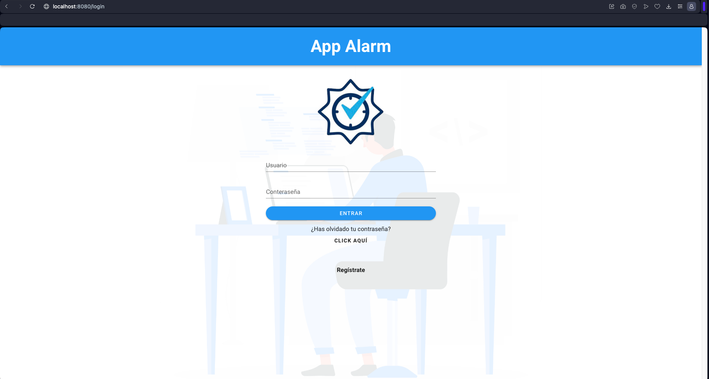
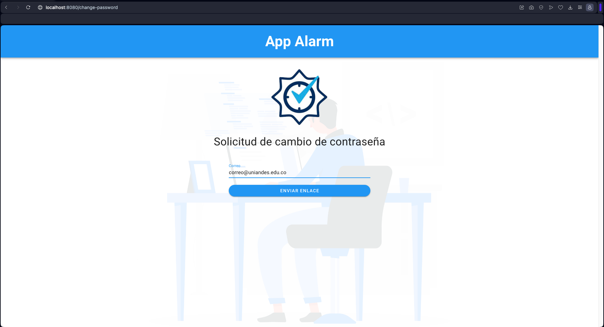
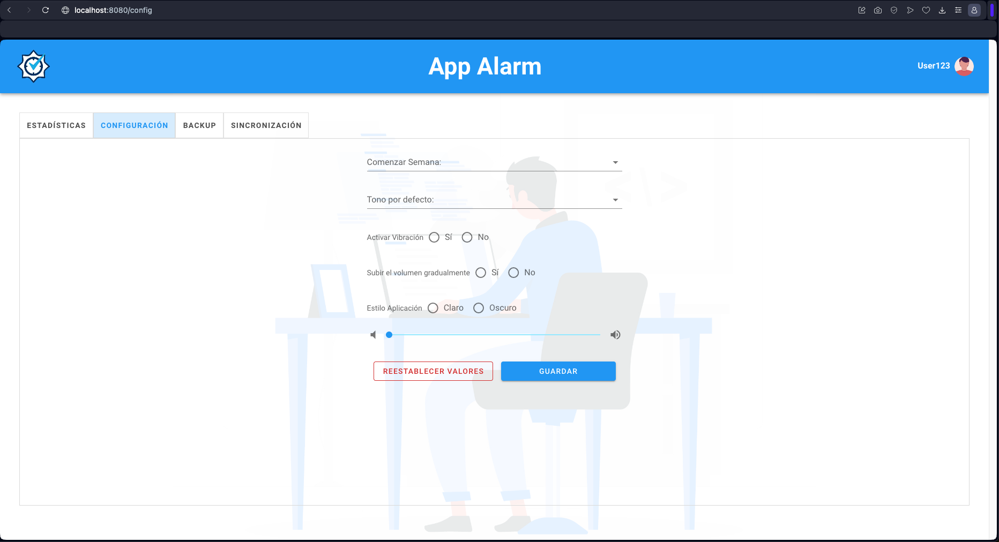

# Pagina Web - App Alarm

## Pre-requisitos
* npm v10.2.4 o superior


## Instalación
Para correr la aplicación de vue, debes seguir los siguientes pasos:
1. Clonar el repositorio y acceder a la raíz del proyecto
```bash
git clone https://github.com/Richardace/UX-AppAlarm-Web.git app-alarm && cd app-alarm
```
2. Instalar dependencias de npm
```bash
npm install
```
3. Lanzar el servidor
```bash
npm run serve
```

## Paginas Richard Acevedo

### Iniciar Sesión



### Solicitar cambio de contraseña



### Ingresa nueva contraseña


### Cambio de contraseña Exitoso


## Páginas Felipe Cerquera
### Estadísticas


### Configuraciones


#### Configuraciones - confirmación


### BackUp


### Sincronización
